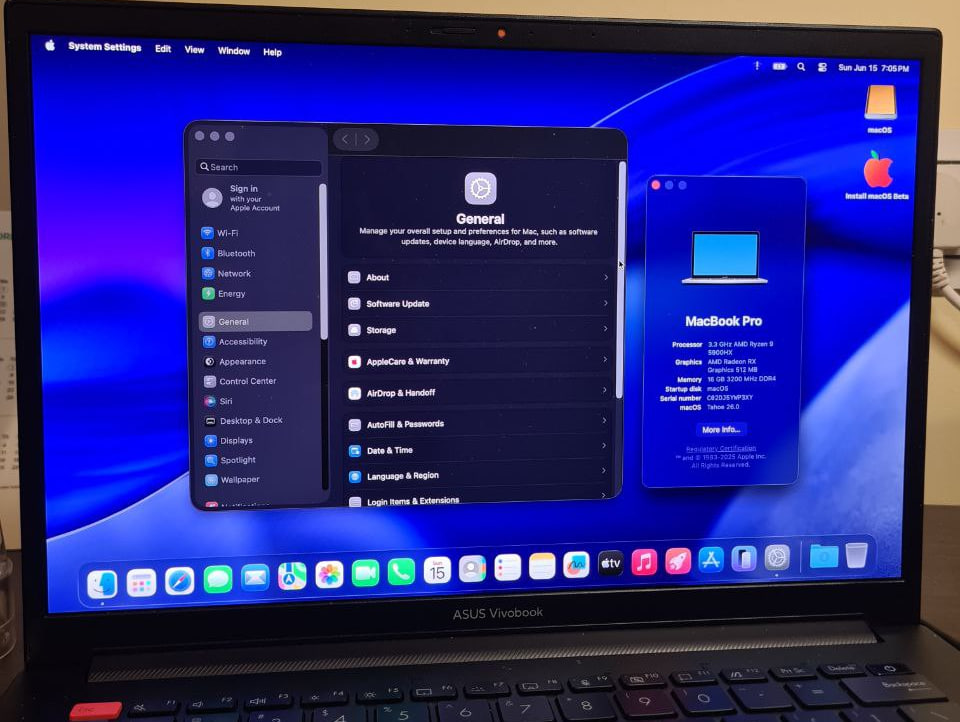

 

<h2 align="center">MacOS on Asus Vivobook Pro 14X [M7400QC]

Ryzen 5900HX &amp; GeForce RTX-3050</h2>

&nbsp;&nbsp;

## Considerations

_Information available only for possible references. I do not recommend following all the information presented here._

You can refer this tutorial : [Link](https://www.youtube.com/watch?v=aXekpCbt2GQ) & image from [olarila](https://olarila.com/topic/6278-olarila-vanilla-images-macos-installer/)

## Table of Contents

- [Considerations](#considerations)
- [Table of Contents](#table-of-contents)
- [Specifications](#specifications)
- [What's Working](#whats-working)
- [What's not Working](#whats-not-working)
- [Bios Options](#bios-options)
- [Kexts Used](#kexts-used)
- [ACPI SSDTs Used](#acpi-ssdts-used)
- [⚠️ Disclaimer](#️-disclaimer)

## Specifications

| Item  | Info  |
| ------------ | ------------ |
| Model  | Vivobook_ASUSLaptop M7400QC_M7400QC  |
| Bios Version  | M7400QC.311 (02-06-2023)  |
| CPU  |  AMD Ryzen 9 5900HX |
| DGPU | GeForce RTX 3050 4GB |
| RAM  | 2 x 16GB SODIMM DDR4 @3200 MHz on board   |
| NVMe  | SK Hynix 1TB (HFM001TD3JX013N)  |
| WIFI  | MediaTek Wi-Fi 6 MT7921 |
| Bluetooth  | MediaTek Bluetooth Adapter MT7921 |
| Audio  | Realtek ALC294 |
| LCD Panel  | 15.6 FHD IPS 165Hz  |
| Opencore Version  | 1.0.2 |
| SMBIOS used  | MacBookPro16,3 (Need to enter your information generated by [GenSMBIOS](http://https://github.com/corpnewt/GenSMBIOS "GenSMBIOS"))  |
| Target MacOS Version  | macOS Tahoe 26 |

## What's Working

| Item | Status | Notes |
| --- | --- | --- |
| CPU | ✅ | AMD Vanilla Auto Patch |
| iGPU | ✅ | |
| USB | ✅ | All ports working with |
| Brightness Control | ✅ | Have to disable Dynamic Contrast |
| Keyboard to avoid flickering | ✅ | Voodoops2controller Kext + [Karabiner-Elements app](https://karabiner-elements.pqrs.org/ "Karabiner-Elements app") for mapping |
| Trackpad | ✅ | VoodooI2C |
| Battery | ✅ | SMCBatteryManager Kext |
| Shutdown/Reboot | ✅ |   |

## What's not Working

| Item | Status | Notes |
| --- | --- | --- |
| dGPU | ❌ | GeForce RTX 3050 |
| HDMI A/V out | ❌ | Because HDMI connects directly to the dGPU, which has been disabled |
| NVMe SKHynix | ❌ | Undetected because of controller (use any other nvme or usb storage device )|
| iServices | ❌ | No internet, was not able to test |
| Audio/Mic | ❌ | |
| WIFI | ❌ | Might try AirportItlwm Kext |
| Bluetooth | ❌ | Might try BlueToolFixup Kext |

## Bios Options

*   Secure Boot **Disabled**

## Kexts Used

| Kext Name                      | Description |
|-------------------------------|-------------|
| AppleALC.kext                 | Enables native audio. |
| AppleMCEReporterDisabler.kext | Disables MCE reporter (prevents CPU panics). |
| AsusSMC.kext                  | Enables sensors/battery for ASUS laptops. |
| BrightnessKeys.kext           | Enables brightness hotkeys. |
| ForgedInvariant.kext          | Fixes CPU topology for AMD. |
| GenericUSBXHCI.kext           | Adds support for unsupported USB 3.0. |
| Lilu.kext                     | Core patching engine. |
| NootedRed.kext                | Enables AMD GPU support. |
| NullEthernet.kext             | Creates dummy Ethernet for iServices. |
| NVMeFix.kext                  | Fixes NVMe SSD power/performance. |
| NVMeFix.kext.dSYM             | Debug symbols (not required). |
| RestrictEvents.kext           | Hides unsupported hardware/events. |
| SMCBatteryManager.kext        | Enables battery status. |
| SMCLightSensor.kext           | Enables ambient light sensor. |
| VirtualSMC.kext               | Emulates Apple's SMC chip. |
| VoodooI2C.kext                | Enables I2C trackpads/touchscreens. |
| VoodooI2CHID.kext             | Adds HID layer for VoodooI2C. |
| VoodooPS2Controller.kext      | Enables PS/2 keyboard and trackpad. |

## ACPI SSDTs Used

| SSDT Name                       | Description |
|--------------------------------|-------------|
| SSDT-ALS0.aml                  | Disables ambient light sensor. |
| SSDT-Disable_GPU_GPP0.aml      | Disables dedicated GPU. |
| SSDT-Disable_Network_GPP4.aml  | Disables unused network device. |
| SSDT-Disable_NVMe_GPP6.aml     | Disables unused NVMe device. |
| SSDT-EC.aml                    | Adds or renames EC device. |
| SSDT-PLUG-ALT.aml              | Enables CPU power management. |
| SSDT-PNLF.aml                  | Enables brightness control. |
| SSDT-RMNE.aml                  | Disables unsupported Wi-Fi card. |
| SSDT-USB-Reset.aml             | Fixes USB issues after sleep. |
| SSDT-USBX.aml                  | Sets USB power properties. |
| SSDT-XOSI.aml                  | Fakes OSI to improve ACPI handling. |

## ⚠️ Disclaimer

This repository is intended for **educational and research purposes only**. Installing macOS on non-Apple hardware (Hackintosh) may **violate Apple's End User License Agreement (EULA)**. By using the information provided here:

- You acknowledge and agree that you are doing so **at your own risk**.
- I am **not responsible** for any damage to your hardware or loss of data.
- This project is **not affiliated with Apple Inc.**, Lenovo, or any other company mentioned.

Thank You
